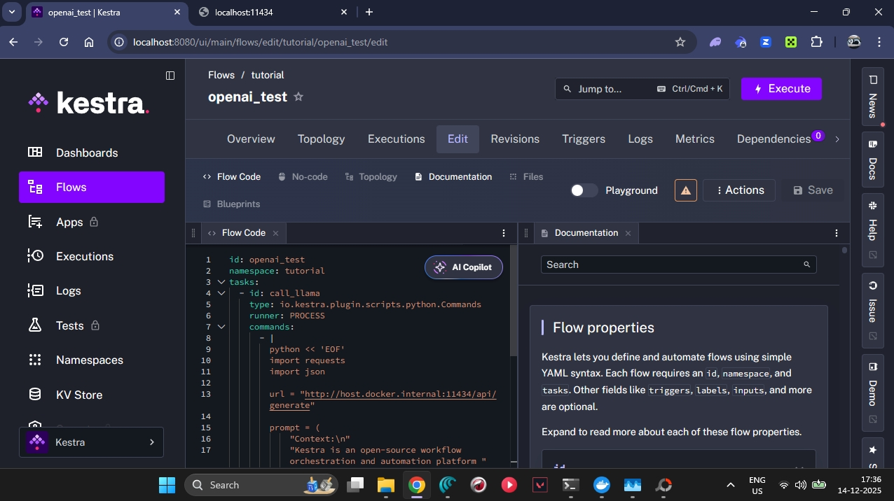
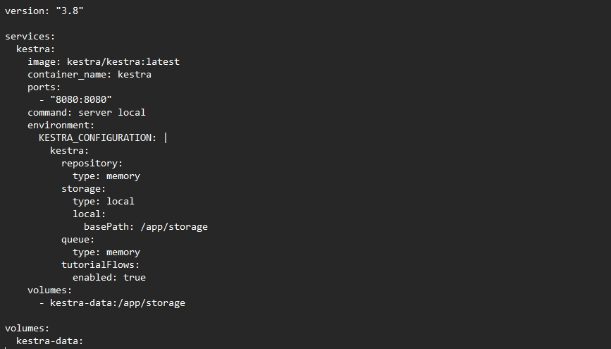

# GovGuide AI 🇮🇳

GovGuide AI is an AI-powered guidance platform that helps users understand Indian government application processes clearly — without agents, middlemen, or misinformation.

---

## 🚀 What This Project Does

GovGuide AI provides:
- Step-by-step guidance for common government services
- Clear explanations in simple language
- A clean UI designed for non-technical users

Currently supported topics include:
- Aadhaar Update
- PAN Card
- Driving Licence
- Bank Account KYC
- Government Exams
- Job Applications

---

## 🛠 Tech Stack

**Frontend**
- Next.js (App Router)
- TypeScript
- Tailwind CSS

**Backend (Planned / Experimental)**
- Kestra (workflow orchestration)
- Local LLM via Ollama (llama3)

> ⚠️ Note: Backend integration is experimental and under development.

---

## ⚙️ Local Setup

### 1️⃣ Clone the repository
```bash
git clone https://github.com/0abhi007/govguide-ai.git
cd govguide-ai


2️⃣ Install dependencies
npm install

3️⃣ Run the frontend
npm run dev


Open your browser and visit:

http://localhost:3000

🧪 Project Status
Component	Status
Frontend UI	✅ Completed
Backend workflow	🧪 In progress
LLM integration	🧪 Experimental
Production deployment	❌ Not yet configured
🧠 Motivation

Government services should be accessible to everyone without confusion or exploitation.
GovGuide AI is an attempt to use AI responsibly to make public information easier to understand.

⚠️ Disclaimer

GovGuide AI is not an official government service.
Information provided is for guidance purposes only and should be verified on official government websites.

👤 Author

Abhishek Kumar Singh
GitHub: https://github.com/0abhi007


---

## ✅ After pasting

Run these commands:

```bash
git add README.md
git commit -m "Add clear project README"
git push


---

## 🧩 Workflow Orchestration (Kestra)

GovGuide AI is designed to use a workflow-based backend powered by **Kestra**.

The workflow is responsible for:
- Accepting user queries
- Orchestrating LLM calls
- Returning structured guidance responses

### 📸 Kestra Workflow Screenshots

**Available flow configuration:**


**Flow execution view:**


**Flow YML definition:**


> ⚠️ Note: Backend integration is currently experimental and runs locally.
